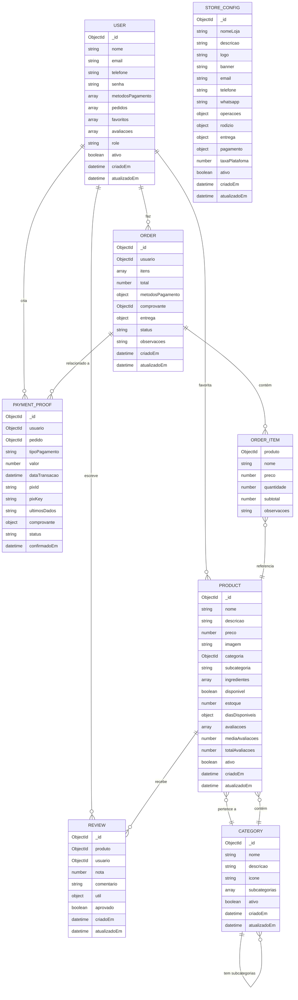
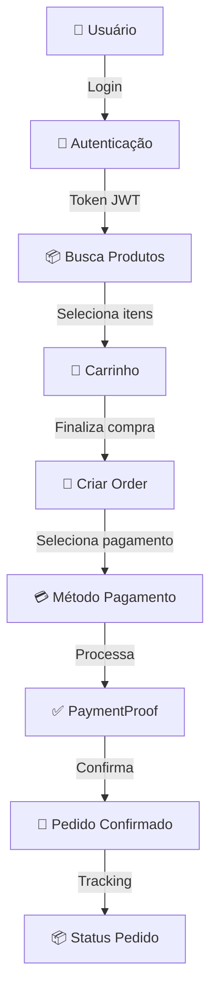
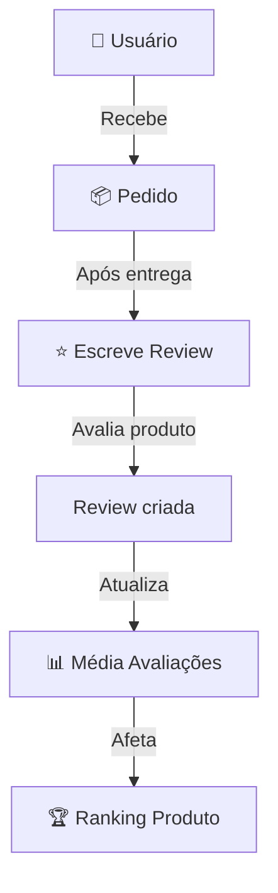
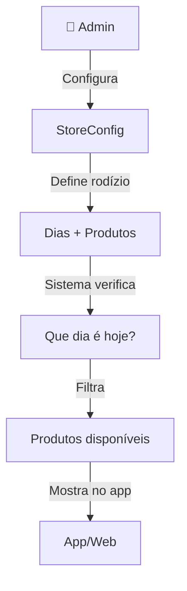

# 📐 Diagrama de Relacionamentos - L&J API

## Diagrama ER (Entity-Relationship)



## Fluxo de Dados

### Fluxo de Compra



### Fluxo de Avaliação



### Fluxo do Rodízio



## Estrutura de Coleções

```
Database: api-lj
├── users (Usuários)
│   └── Índices: _id, email (unique)
├── products (Produtos)
│   └── Índices: _id, categoria, nome_descricao (text search)
├── categories (Categorias)
│   └── Índices: _id, nome (unique)
├── orders (Pedidos)
│   └── Índices: _id, usuario, status, criadoEm
├── reviews (Avaliações)
│   └── Índices: _id, produto, usuario (unique combo)
├── payment_proofs (Comprovantes)
│   └── Índices: _id, usuario, pedido, status
└── store_configs (Configurações)
    └── Índices: _id
```

## Relacionamentos Principais

### 1. Uma para Muitos (1:N)

```
Category --1:N--> Product
  1 categoria pode ter N produtos

User --1:N--> Order
  1 usuário pode fazer N pedidos

User --1:N--> Review
  1 usuário pode fazer N avaliações

Product --1:N--> Review
  1 produto pode receber N avaliações

Order --1:N--> OrderItem
  1 pedido contém N itens
```

### 2. Muitos para Muitos (N:N)

```
User --N:N--> Product (via favoritos)
  1 usuário pode favoritar N produtos
  1 produto pode ser favoritado por N usuários
```

### 3. Referências (Foreign Keys)

```
Order.usuario -> User._id
Order.comprovante -> PaymentProof._id
Order.itens[].produto -> Product._id

Product.categoria -> Category._id
Product.avaliacoes[] -> Review._id

Review.produto -> Product._id
Review.usuario -> User._id

PaymentProof.usuario -> User._id
PaymentProof.pedido -> Order._id

User.pedidos[] -> Order._id
User.avaliacoes[] -> Review._id
User.favoritos[] -> Product._id
```

## Tipos de Dados Usados

| Tipo | Exemplo | Uso |
|------|---------|-----|
| String | "João Silva", "joao@email.com" | Texto |
| Number | 45.90, 20, 5 | Preços, quantidades, notas |
| Boolean | true, false | Status, disponibilidade |
| Date | new Date() | Timestamps, datas de entrega |
| ObjectId | "507f1f77bcf86cd799439011" | Referências entre coleções |
| Array | [...] | Múltiplas ocorrências |
| Object | { tipo: 'pix', ... } | Dados estruturados |

## Índices para Performance

```javascript
// User
User.index({ email: 1 }, { unique: true })

// Product
Product.index({ nome: 'text', descricao: 'text' })
Product.index({ categoria: 1 })

// Order
Order.index({ usuario: 1, criadoEm: -1 })
Order.index({ status: 1 })

// Review
Review.index({ produto: 1, usuario: 1 }, { unique: true })

// PaymentProof
PaymentProof.index({ usuario: 1, criadoEm: -1 })
PaymentProof.index({ status: 1 })

// Category
Category.index({ nome: 1 }, { unique: true })
```
